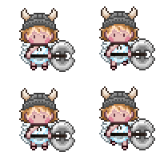
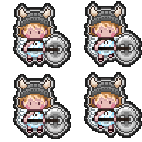
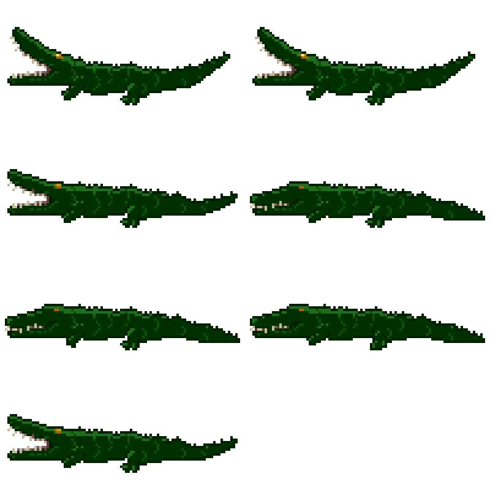

### Overview - Requirements: 10, 20

The software will be a game. It will utilize the theming of the _Isle of dread_ campaign.
https://en.wikipedia.org/wiki/The_Isle_of_Dread

The story will take inspiration from the campaign. 
The player characters and monsters will be built in the style of dnd preferable from the campaign but if that's not possible then dnd in general will be the inspiration.

The game will be implemented using a game engine. LibGDX is suitable engine for the requirements https://libgdx.com/ and will be used for this project as the team all has familiarity using java.

### Buttons - Requirements: 60, 61
Buttons will be implemented using three button components defined by LibGDX

https://javadoc.io/doc/com.badlogicgames.gdx/gdx/latest/com/badlogic/gdx/scenes/scene2d/ui/TextButton.html
https://javadoc.io/doc/com.badlogicgames.gdx/gdx/latest/com/badlogic/gdx/scenes/scene2d/ui/ImageButton.html
https://javadoc.io/doc/com.badlogicgames.gdx/gdx/latest/com/badlogic/gdx/scenes/scene2d/ui/ImageButton.html

These three components will implement the game control for branching through the story and taking actions in combat. 
The image button should be used over the standard button in cases where high levels of styling is needed. The skin class can be applied to an image button which lets it act within an image.

https://javadoc.io/doc/com.badlogicgames.gdx/gdx/latest/com/badlogic/gdx/scenes/scene2d/ui/Skin.html

### Console Component - Requirements: 60, 63
A console like component will be created. 
It will be in the style of a game dialog box and allow the user to scroll up or down to view previous and the current text. The scrolling action will respond to mouse click and drag or mouse wheel input. 

Each output to the console will be delinted based on what the source of the text was. Types will be defined for each possible source.
The types of text this box handles are at least as follows:
* Non-Player Character Dialog
* Game Events
* Combat Results (including dice rolls, damage)
* General Story Text
* Skill Check Results

This component will be implemented in such a way to allow either a prefix for each message showing the source of the text or color to distinguish between them. For example the prefix would be "Character Name:" for character dialog.

In order to accomplish displaying text from any source this component will have a public method that can be called passing in the string value to append to the console and the type of message being appended. 

The types of messages should be defined  in a separate object as based on the needs of other requirements and designs. The object defining the types of messages will be an enum or something similar, only defining the types of messages that are valid and can be handled. 

LibGDX defines a scroll pane object that would suit the needs of this component https://javadoc.io/doc/com.badlogicgames.gdx/gdx/latest/com/badlogic/gdx/scenes/scene2d/ui/ScrollPane.html
After each update the component would set it scroll positions to the maximum value.
This way by default it stays with the most recent appended text. 
A text field will be a child within the scroll component which should allow vertical scaling to enable the scrolling https://javadoc.io/doc/com.badlogicgames.gdx/gdx/latest/com/badlogic/gdx/scenes/scene2d/ui/TextArea.html

=======
### Primary Image Display - Requirments: 60, 62
This component will be a large component near the center and top of the UI. It will display an image relevant to the current story point. 
The data objects defined in _Data loading - Requirements: 70_ will have a path by which to load the image. Each time the current story context updates this component will pull that path from the object and load the image.

LibGDX defines a simple image class that will be used to display to given image in the component
https://javadoc.io/doc/com.badlogicgames.gdx/gdx/latest/com/badlogic/gdx/scenes/scene2d/ui/Image.html

All story objects will be built to make sure this component is always displaying an image.

Images will be stored in the assets directory of the final project, meaning the LibGDX engine will be able to find and load them.

### Character and Ability Definitions - Requirments: 40, 50, 51, 52, 53, 54
[characters.md](./characters.md)

### GUI (60 - 65)
Widgets displayed using libGDX's table class in a black background with white text and detailing 
* Window will be 1000 x 600 pixels and will be split into 20 columns x 12 rows 
* Image container will be 600 x 400 pixels
* each sprite will be 100 x 100 pixels, side by side to create a 400 x 100 pixel block
* the terminal display will be 600 x 100 pixels
* the button panel will be 100 x 200 pixels
* the player stats panel will be 100 x 100 pixels

UI skin provided by kenney: https://github.com/czyzby/gdx-skins/tree/master/kenney-pixel

### Character Sprites: requirements 75, 80
* the root table will display the four sprites side by side in 100 x 100 pixel blocks above the terminal and below the image display
* the active fighter will be denoted by a white highlight that will loop through each character in the proper fighting order

### Data loading - Requirements: 70
The game will have all of the necessary objects for story, monsters, players, events stored in json objects that are loaded in sequence as needed. Event objects will include references to different possible branches that can be obtained. The UI will load these then go and fetch the next object as needed.

Event Object Mock: [mock.json](./mocks/eventobject.json)

Loading data sequence diagram

The UI will control the flow to the next data object determined by the possible branches or the statues within the object.
Each event object will contain the necessary data to update all the UI conponents.

### 110
[monsters.md](./monsters.md)

### Monster Sprites: 110

