### Overview - Requirements: 10, 20

The software will be a game. It will utilize the theming of the _Isle of dread_ campaign.
https://en.wikipedia.org/wiki/The_Isle_of_Dread

The story will take inspiration from the campaign. 
The player characters and monsters will be built in the style of DnD preferable from the campaign but if that's not possible then DnD in general will be the inspiration.

The game will be implemented using a game engine. LibGDX is suitable engine for the requirements https://libgdx.com/ and will be used for this project as the team all has familiarity using java.

### Overall Game Flow - Requirements: 30, 60, 70, 130

This flow diagram shows the connections of the major game component classes and how they tie together to progress through the story and combat.

* Main GUI: Contains buttons and other components that change based on the current game state
* State Manager: Determines based on the current state if data needs to be loaded and which manager classes is currently sending updates
* Story Event Manager - Handles the logic and dice rolls needed for non combat events
* Combat Event Manager - Handles combat damage, rolls, and non-player character control.

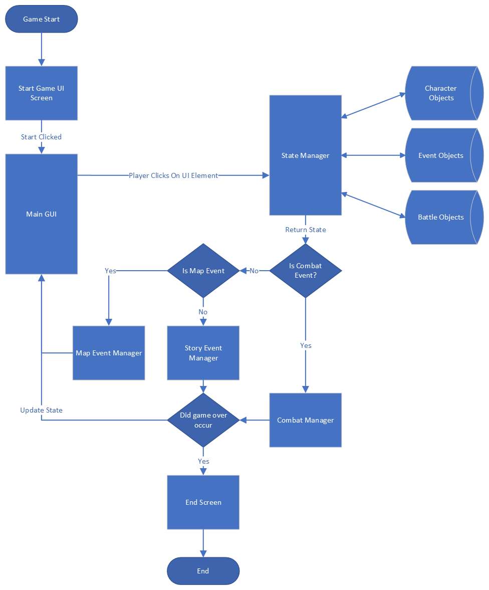

### Defined Characters - Requirements: 40
Characters will be defined using JSON objects they will follow the formatting defined in the [characters.md](./characters.md)

The characters file contains a set of "features" which include combat abilities and non-combat abilities that will be included in the actions the player can perform. These actions will be created and implemented based from there original DND counterparts 

All actions the player can take in game will come from the pre-defined characters.

### Buttons - Requirements: 60, 61
Buttons will be implemented using three button components defined by LibGDX

https://javadoc.io/doc/com.badlogicgames.gdx/gdx/latest/com/badlogic/gdx/scenes/scene2d/ui/TextButton.html
https://javadoc.io/doc/com.badlogicgames.gdx/gdx/latest/com/badlogic/gdx/scenes/scene2d/ui/ImageButton.html
https://javadoc.io/doc/com.badlogicgames.gdx/gdx/latest/com/badlogic/gdx/scenes/scene2d/ui/ImageButton.html

These three components will implement the game control for branching through the story and taking actions in combat. 
The image button should be used over the standard button in cases where high levels of styling is needed. The skin class can be applied to an image button which lets it act within an image.

https://javadoc.io/doc/com.badlogicgames.gdx/gdx/latest/com/badlogic/gdx/scenes/scene2d/ui/Skin.html

### Console Component - Requirements: 60, 63
A console like component will be created. 
It will be in the style of a game dialog box and allow the user to scroll up or down to view previous and the current text. The scrolling action will respond to mouse click and drag or mouse wheel input. 

Each output to the console will be delinted based on what the source of the text was. Types will be defined for each possible source.
The types of text this box handles are at least as follows:
* Non-Player Character Dialog
* Game Events
* Combat Results (including dice rolls, damage)
* General Story Text
* Skill Check Results

This component will be implemented in such a way to allow either a prefix for each message showing the source of the text or color to distinguish between them. For example the prefix would be "Character Name:" for character dialog.

In order to accomplish displaying text from any source this component will have a public method that can be called passing in the string value to append to the console and the type of message being appended. 

The types of messages should be defined  in a separate object as based on the needs of other requirements and designs. The object defining the types of messages will be an enum or something similar, only defining the types of messages that are valid and can be handled. 

LibGDX defines a scroll pane object that would suit the needs of this component https://javadoc.io/doc/com.badlogicgames.gdx/gdx/latest/com/badlogic/gdx/scenes/scene2d/ui/ScrollPane.html
After each update the component would set it scroll positions to the maximum value.
This way by default it stays with the most recent appended text. 
A text field will be a child within the scroll component which should allow vertical scaling to enable the scrolling https://javadoc.io/doc/com.badlogicgames.gdx/gdx/latest/com/badlogic/gdx/scenes/scene2d/ui/TextArea.html

### Primary Image Display - Requirements: 60, 62
This component will be a large component near the center and top of the UI. It will display an image relevant to the current story point. 
The data objects defined in _Data loading - Requirements: 70_ will have a path by which to load the image. Each time the current story context updates this component will pull that path from the object and load the image.

LibGDX defines a simple image class that will be used to display to given image in the component
https://javadoc.io/doc/com.badlogicgames.gdx/gdx/latest/com/badlogic/gdx/scenes/scene2d/ui/Image.html

All story objects will be built to make sure this component is always displaying an image.

Images will be stored in the assets directory of the final project, meaning the LibGDX engine will be able to find and load them.

### Character and Ability Definitions - Requirements: 40, 50, 51, 52, 53, 54
[characters.md](./characters.md)

### GUI (60 - 65) 
[GUI-flow](./images/GUI-flow.png)
Widgets displayed using libGDX's table class in a black background with white text and detailing 
* Window shall be 1000 x 600 pixels *and will be split into 20 columns x 12 rows (subject to change)*
* Image container will be 600 x 400 pixels
* each sprite will be 100 x 100 pixels, side by side to create a 400 x 100 pixel block
* the terminal display will be 600 x 100 pixels
* the button panel will be 100 x 200 pixels
* the player stats panel will be 100 x 100 pixels

UI skin provided by kenney: https://github.com/czyzby/gdx-skins/tree/master/kenney-pixel

### Character Sprites: requirements 75, 80
* the root table will display the four sprites side by side in 100 x 100 pixel blocks above the terminal and below the image display
* the active fighter will be denoted by a white highlight that will loop through each character in the proper fighting order

#### Barbarian Human

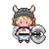
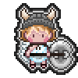

#### Monk Elf

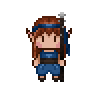
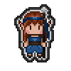

#### Rogue Tiefling

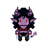
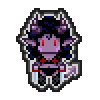

#### Wizard Gnome

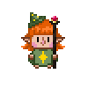
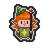

### Data loading - Requirements: 70
The game will have all of the necessary objects for story, monsters, players, events stored in json objects that are loaded in sequence as needed. Event objects will include references to different possible branches that can be obtained. The UI will load these then go and fetch the next object as needed.

Event Object Mock: [mock.json](./mocks/eventobject.json)

Loading data sequence diagram

The UI will control the flow to the next data object determined by the possible branches or the statues within the object.
Each event object will contain the necessary data to update all the UI components.

### 100 - Story
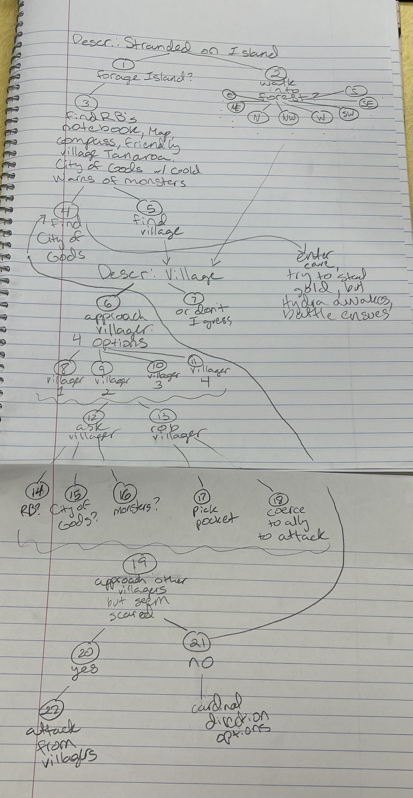
(anything in parentheses is unknown to the players)

# Villager 1
* Physical description: gray hair, eye patch, tall-as big as barbarian-a sneer on his face
* Answers to Questions
    * Event 14: "Don't know anything about him. No one with that name or notebook has ever come through this time."
      (he actually totally knows him, and killed him)
    * Event 15: "Sounds like children's story if you ask me. You folks best be on your way before you be asking
      risky questions like that. People 'round here don't take kindly to strangers or their questions."
    * Event 16: gives good advice for monsters

# Villager 2
* Physical description: Thin woman with a baby, looks to be in her twenties. Brown hair in low bun with strands
  hanging out. Dirty dress that looked like it once had color. Looks scared.
* Answers to Questions:
    * Event 14: "No, I'm sorry, I've never heard of him."
    * Event 15: "Everyone's heard of the City of Gods. It's just a myth though. Lord knows we're neither lucky nor
      strong enough to venture out there even if we tried."
    * Event 16: "Be careful of the monsters out there. Anyone who's ventured further than a few miles outside this
      village was killed."

# Villager 3
* Physical description: Woman with dark skin and smooth dark hair. Pirate-y garb. Beautiful, buff. Looks to be in
  charge. (Is actually a cannibal and will attack if this villager is approached)
* Answers to Questions
    * Event 14: "RB? Oh yeah, he's still out there ya know. First to travel this jungle. I've never met him, but
      heard lots of stories of his travels. Wish I could be him."
    * Event 15: "Oh the City of Gods is real alright, if you can make it through the jungle."
    * Event 16: "Seems like they'll be easy for you lot."

# Villager 4
* Physical description: Little boy, about 10 years old, dirty clothes, who is trying to get away with stolen bread
* In event 13.1, answers to questions
    * Event 14: "RB was last seen in this village. I heard he found the City of Gods but didn't survive long enough to
      come back and tell the tale. He must've still gotten his notebook out to you guys before he was gone forever."
    * Event 15: "Of course the City of Gods is real! How could you not know?"
    * Event 16: "The Hydra is the most powerful." you have to use a specific wizard spell for the most success                   

### 110 - Monsters & Monster Attacks
[monsters.md](./monsters.md)

The attacks of the monsters will consist as follows:

Hydra:  
- Bite - If a Melee Weapon is equipped, Attack (+8 on hit), DMG is equal to (1d10 + 5) piercing.  
- Fire Breath - Ranged Attack (no weapon bonus), DMG is equal to (1d12 + 5).  
- Multi-attack - Attack is done based on how many heads the Hydra has left. DMG is equal to (1d8 + 2), DMG will decrease if one or multiple heads on severed.

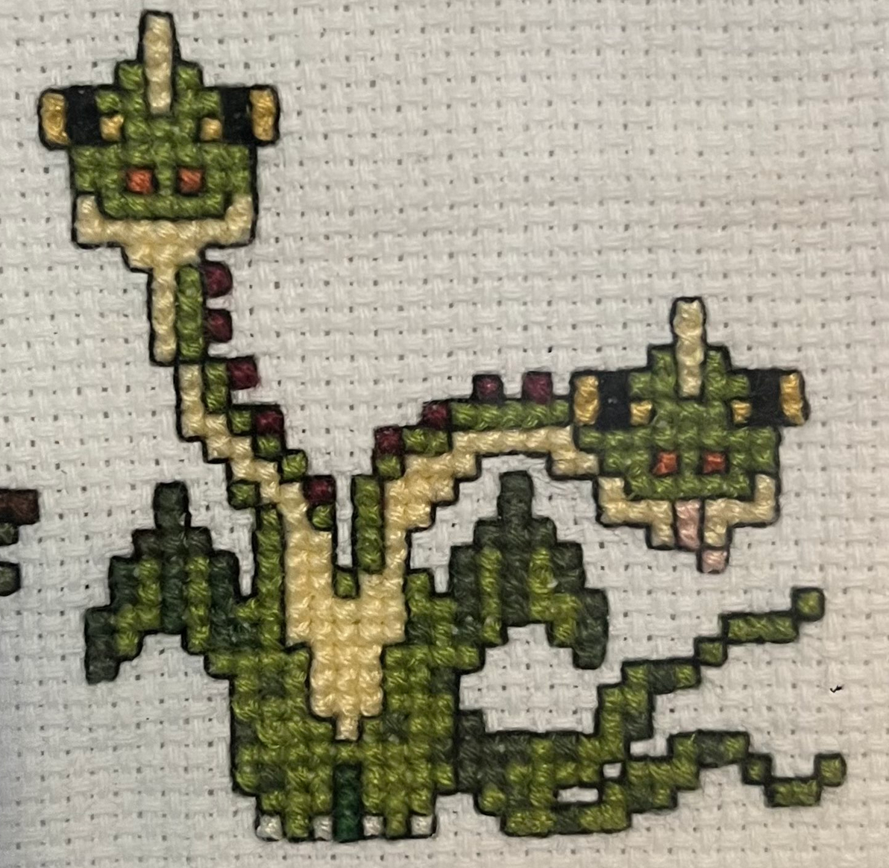

Crocodile:  
- Bite - If a Melee Weapon is equipped, Attack (+4 on hit), DMG is equal to (1d10 + 2) piercing. Creates grapple effect (player bitten cannot attack until a successful dice roll of 12 or higher is met, releasing them from the jaws.)  
- Tail Whip - Melee Attack, DMG is equal to (1d 8+ 1). Has a 30% chance to leave the player hit stunned for a turn.  
- Stomp - Melee Attack, DMG is equal to (1d6 + 1).

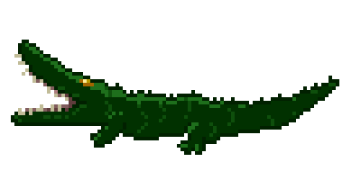

Carnivorous Ape:  
- Fist - If a Melee Weapon is equipped, Attack (+5 on hit), DMG is equal to (1d6 + 3) bludgeon.  
- Rock Throw - If a Ranged Weapon is equipped, Attack (+5 on hit), DMG is equal to (1d6 + 3) bludgeon.  
- Feral Bite - If a Melee Weapon is equipped, Attack (+8 on hit), DMG is equal to (1d10 + 4) piercing. Has a chance to cause a bleeding effect on player bitten, causing a percentage of HP to be lost each turn for 2 turns.

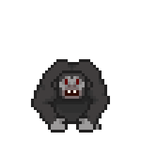

### 115 - Combat System
[Combat Inspiration](https://www.dndbeyond.com/sources/basic-rules/combat)

Each instance of combat will be a turn-based system. During a player's turn, they will have the option to chose an action of their choice. Once this choice is made, the action chosen will be represented accordingly. Once each player has taken their action accordingly, the monster(s) of which they will be initiated in combat with will also chose it's action based upon the same criteria of the players. Combat continues on in this manner until there is a winner of the instance. 

When attacks are chosen, a dice is rolled to determine the attack power of the attack, along with if there is a weapon equipped a bonus stat will be applied to the overall attack to further enhance the attack power. Also, damage taken between both characters and monsters when an attack is used will also take into account the 'Armor Class' (AC) of the character(s) and monster(s) being attacked. Further enhancing the overall concept of the amount of damage that is to be taken by both parties during combat. 

If a player is defeated within the combat instance (HP value <= 0), then they will no longer be able to partake in the given combat instance. Once the instance is over, other party members can revive them, giving them a small portion of their max HP value back. If the monster/monster(s) within the combat instance is/are defeated, there will be a pop-up message displaying the current status of the party members, along with the EXP gained accordingly as determined by the type of enemy defeated.

### 120 - Story Option Prompts
Based upon a given instance, if a character initiates an action with a sub-event, a dice roll will also be done to determine a given sub-stat (ex. accuracy) of the instance.  
    - If accuracy occurs, the dice roll will be done on a (1d20) scale, plus any equipment and/or skills that can cause luck to be increased for the dice roll.  

For example, if the Elf character were to have an instance where they had multiple moves in a turn (lets say 3 for this example), then a dice roll would happen in order to determine the accuracy of all 3 of the separate given moves, each with their own accuracy value based on the completed dice roll.

### 130 - Story Combat Encounter Instances
Given a certain spot of the game's story, combat encounters will occur based upon the story (i.e. what environment the party is in, how far along the party's quest is, surprise encounters, etc.)  

### Game Over Screen - Requirements: 140
The game over screen should have the option between two text being displayed. Either "Adventure Failed" or "Adventure Success" 

The screen also will include a button to that closes the game. 

Mock:
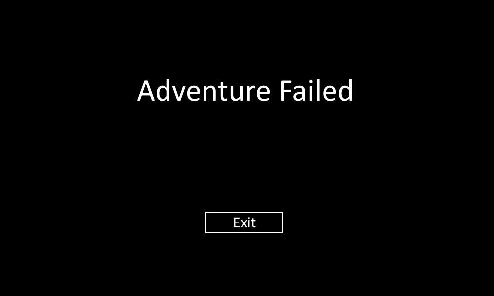