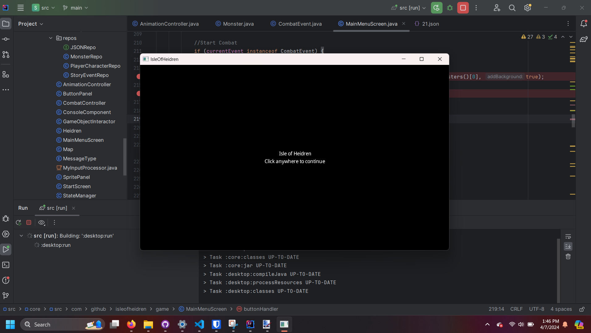
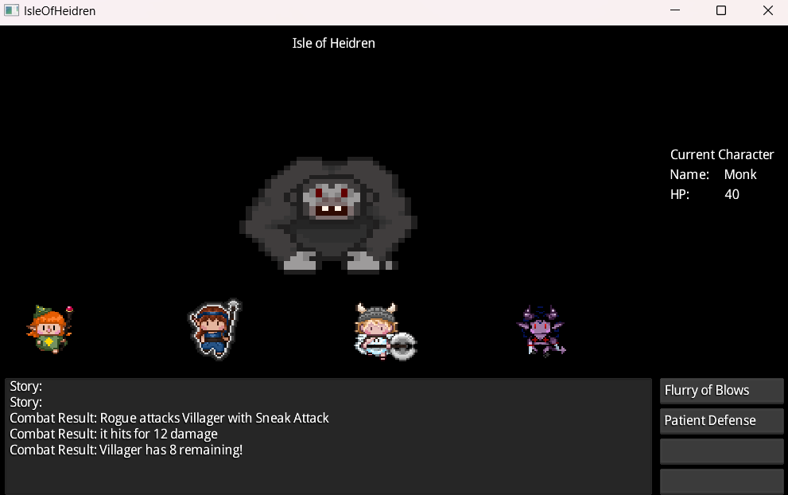
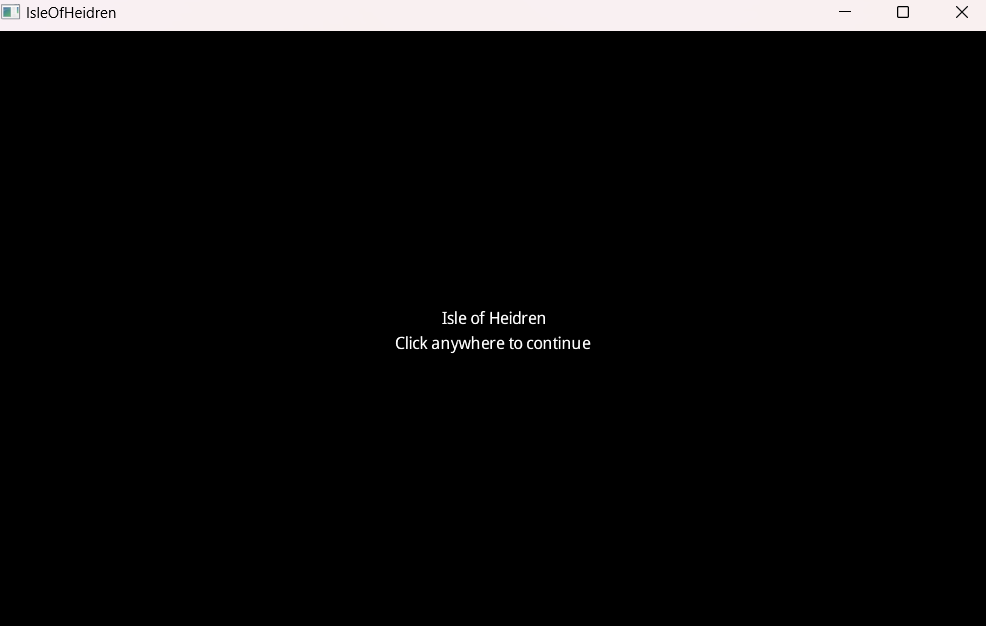
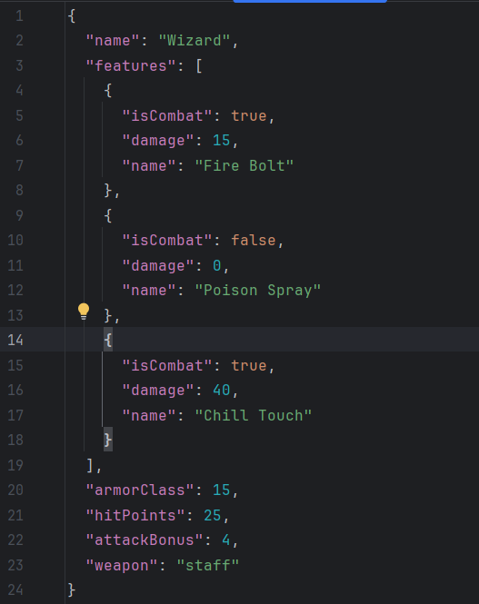
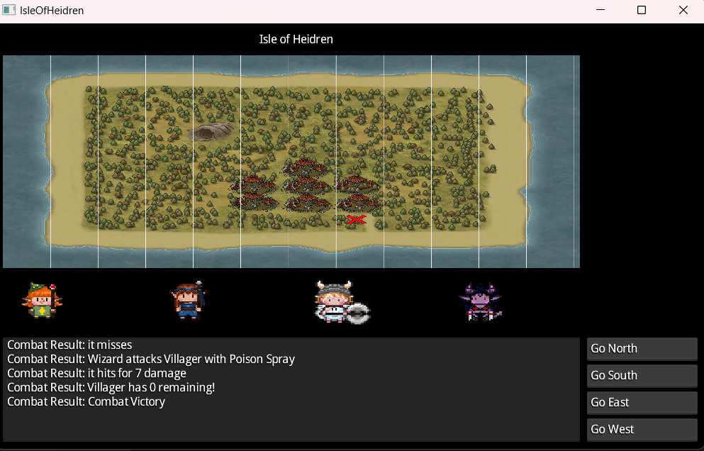
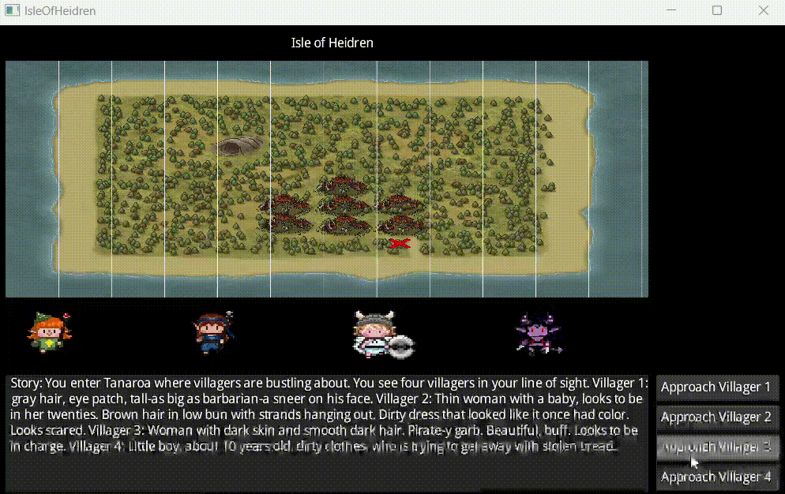
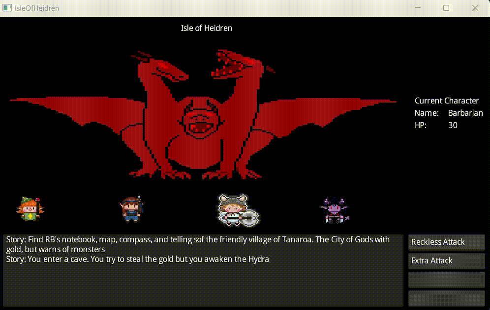
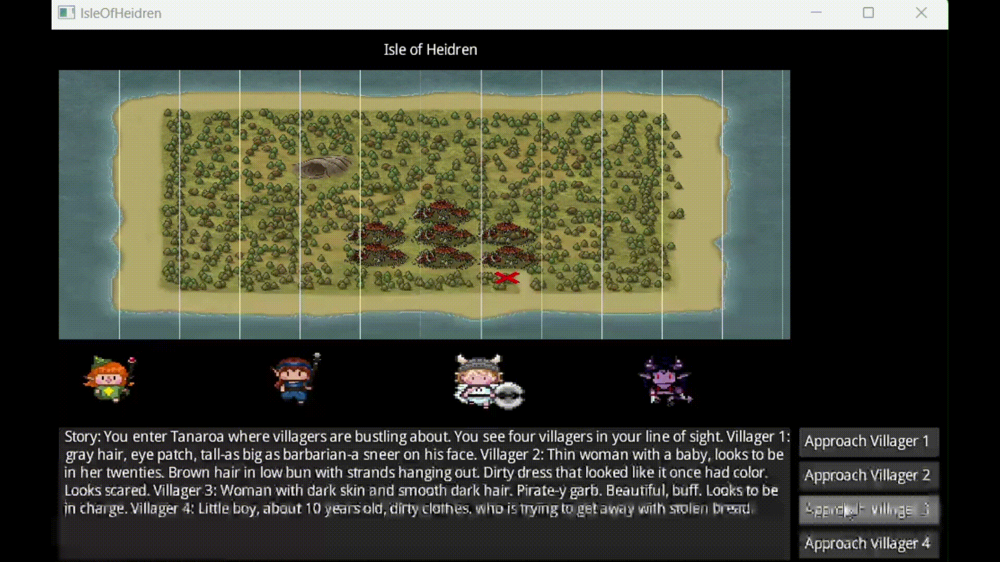
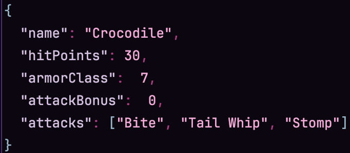
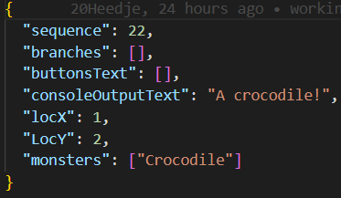

# Requirements

* 10\. Will be a desktop game
    * 10e: Passes evaluation
    * 10 Implementation: The game runs in a desktop window
    

* 20\. Will be based on DnD
    * 20e: Evaluation Passed
    * 20 Implementation: The attacks listing in the buttons of this screenshot are DnD attacks
    

* 30\. Will have a start screen
    * 30e: Evaulation Passed
    * 30 Implementation: When the game runs it opens to a start screen
    

* 40\. Will play as a pre-defined character
    * 40e: Evaulation Passed
    * 40 Implementation: Characters are defined in the JSON files and the game and game aspects stem from those definitions. Ex. Wizard
    

* 50\. Will play with 4 characters
    * 50e: Evaluation Passed
    * 50 Implementation: Four characters are on the main screen and combat rotates through them
    

* 51\. Each player will have a set of stats, features/abilities that differ from one another. These stats will be based from DnD
    * 51e: Evaluation Passed
    * 50 Implementation: The wizard has stats defined in their json document
    

* 60\. Will have a main GUI with components that change dynamically based on the game state
    * 60e: Evaluation Passed
    * 60 Implemenation: The game changes from a map to a animated combat screen with a stats panel
    

* 61.0\. Will have buttons that are mouse clickable to interact with the game
    * 61.0e: Evaluation Passed
    * 61 Evaluation:
    [gif of mouse iteraction](./images/mvp/game_interaction_with_mouse.mp4)

* 61.1\. buttons shall be dynamic based on valid story actions, and will include character specific actions
  * 61.1e: Evaluation Passed
  * 61.1 Implementation: buttons change based on if in story or combat or on the map
  

* 61.2\. In combat each player will take turns doing one action which will be defined in the button panel
  * 61.2e: Evaluation Passed
  * 61.1 Implementation: The combat mode shows which player is active with highlighting and the relavant attacks are on the buttons
  
  
* 62.0\. Shall have a primary image container showing environmental PNGs that are relevant to the current game state
    * 62.0e: Evaluation Failed:
    * 62.0 Implementation: We ending up focusing on the combat and map images and did not have enough time to create images for the various scenes.

* 62.1\. During combat or NPC interactions, the image container will display relevant NPCs and monsters
    * 62.1e: Evaluation Passed
    * 62.1 Implementation: The game either shows a image of a monster you are fighting or where you are on the map
    

* 63\. Will have a console-like output for game text, battle results, and story
    * 63e: Evaluation Passed
    * 63 Implementation: The game has a console like text output box at the bottom of the screen
    

* 64.0\. Each playable character shall be pictured as sprites in the main window. These sprites may be animated.
  * 64.0e: Evaluation Passed
  * 64.0 Implementation: Aninmated sprites are on the screen for all the characters
  

* 64.1\. UI will indicate which character is active (turn) in combat by highlighting the character's sprite. This includes monster and NPC sprites
  * 64.1e: Evaluation Passed
  * 64.1 Implemenation:
  

* 65\. In combat, the currently selected character's stats shall be pictured next to the image container. Outside of battle, the panel shall be blank
  * 65e: Evaluation Passed
  * 65 Implementation: The stat panel displays when combat is entered
  

* 70\. Shall have a way to retrieve data for stats, characters, monsters, and events
    * 70e: Evaluation Passed
    * 70 Implementation: The game utilizes a repo model to prevent hard coupling of specific game logic 
    

* 80\. Will have map in database that either will be shown by text or GUI component
    * 80e: Evaluation Passed
    * 80 Implementation
    

* 81\. Map will have multiple locations
    * 81e: Evaulation Passed
    * The map is a 10x10 grid with events defined some of the squares. Events have locations defined within their json
    

* 90\. Will have story from start to finish no matter what combination of pre-defined actions each character takes
    * 90e: Evaluation Failed
    * 90 Implemenation: The game has many story events and a final fight, but does not redirect to a game over or game victory screen when story should be over. We did not have enough time with the combat to link things together properly to acheive that
    
  

* 100\. Shall have at least 3 types of monsters
    * 100e:
    
    | Test #  | Test Content                         |        
    |---------|--------------------------------------|
    | #1      | Inspect game directory for JSON files for the three monsters |

* 105\. The combat system with a clear winner and damage taken to each side, the combat will take the format of DND according to https://www.dndbeyond.com/sources/basic-rules/combat
    * 105e:
    
    | Test #  | Test Content                         |        
    |---------|--------------------------------------|
    | #1      | Demonstrate that the combat system uses a DND format |

* 110\. The game will prompt the player with story options displayed in the UI utilizing the buttons, image container, and console
    * 110e: Evaluation Passed
    * 110 Implemenation:
    

* 120\. The game will have a combat mode when the story dictates it necessary
    * 120e: Evaluation Passed
    * 120 Implemenation: Various events are defined as combat events and those trigger how many monsters and what monsters the player will fight
    

* 130\. Will have an end screen that displays a game over or game won text
    * 130e: Evaluation Failed
    * 130 Implementation: We ran out of time to implement the game over screen. Early combat components took longer than expected to complete and those were required to link to a screen.
