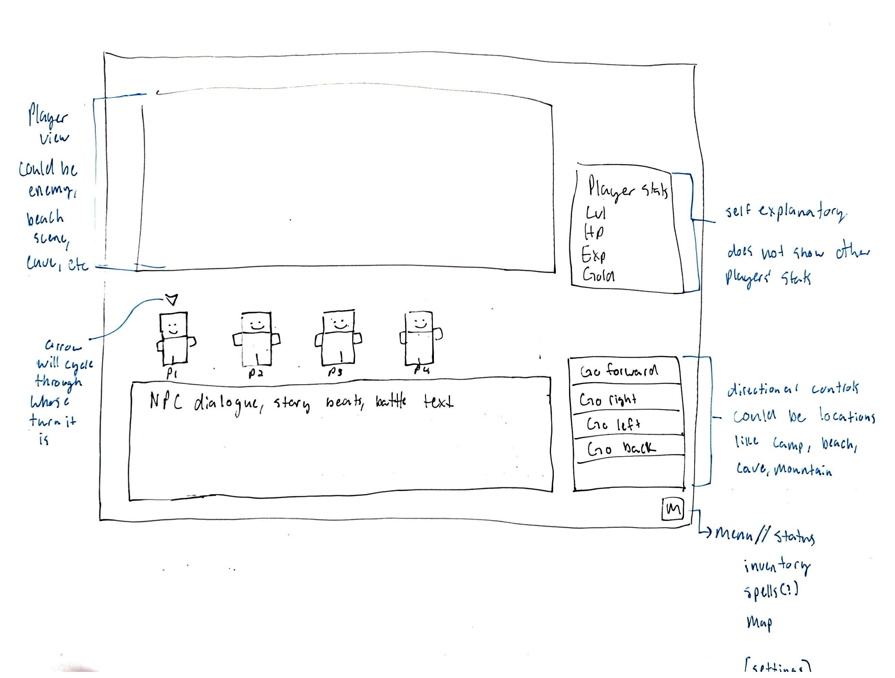

# Project Proposal Overview

## Details
Team Name: Isle of Heidren

Team Members:
* Bella Brickler
* Ren Paxson
* Heidi Raber
* Joseph Claborn

## Synopsis
The project goal is to create a text based game inspired by Dungeons and Dragons, The Isle of Dread, a pre-written campain from the 80's. The player will control a set a charaters through the prebuilt campain. They will be able to fight monsters and interact with NPCs and the world.

## Components
* Main GUI
  * Window that shows current environment or battle map
  * Panel showing current actions for game state
  * Panel displaying all characters showing which is selected
* Simple monster and npc battle "AI"
* Generalized game framework using JSON objects for each NPC/Monster/Location/Battlemap

## GUI Mock

